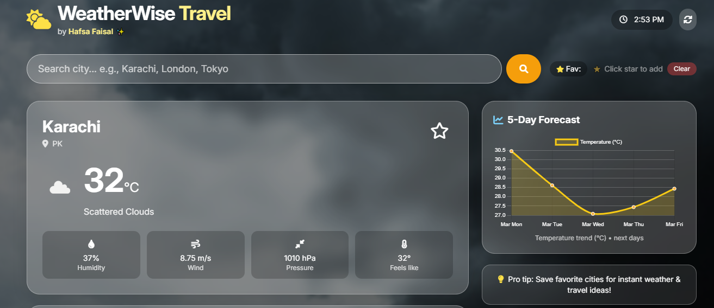
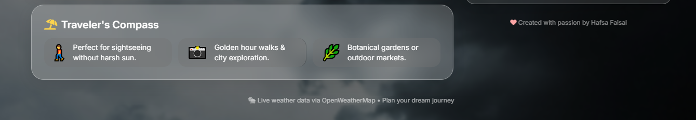

# Weather & Travel Planner App 🌍☀️

An interactive web app to check real-time weather forecasts, see dynamic visuals, and get travel/activity suggestions based on the weather. Fully responsive and built with **HTML, CSS, JavaScript, and React.js**.

---

## 🔗 Live Demo
[View Live Project](https://your-vercel-link.vercel.app)

---

## 📸 Screenshots

  

---

## 🛠️ Features
- Search for any city and see current weather & weekly forecast.  
- Dynamic backgrounds & animations based on weather conditions.  
- Travel and activity suggestions depending on the weather.  
- Responsive design for desktop and mobile.  
- Smooth UI animations & transitions for a modern feel.  

---

## 🧰 Tech Stack
- HTML5  
- CSS3  
- JavaScript (ES6+)  
- React.js  
- Bootstrap/Tailwind (for layout)  
- OpenWeatherMap API (for real-time data)  

---
